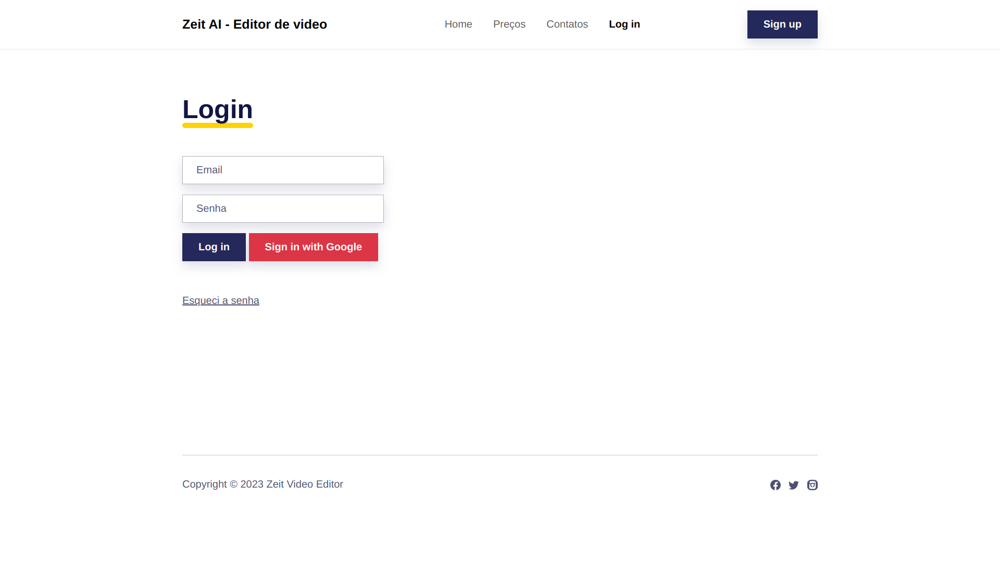

# Zeit - AI Video Editor

## What it is
Zeit is a project that aims to automate the process of editing videos for platforms such as Tiktok, Youtube Shorts and Instagram.

## How it works
It uses a script to download the video from Youtube, once stored, Zeit extracts the length of the video and uses FFMPEG to trim it to the desired duration. 
It then saves the cut versions of the video in a folder ready to be used.

## Next steps
Our goal is to implement an AI that analyses the videos and extracts relevant information from it, such as context, transcript, title; and then generates titles and descriptions for the shorter versions according to the context. 

